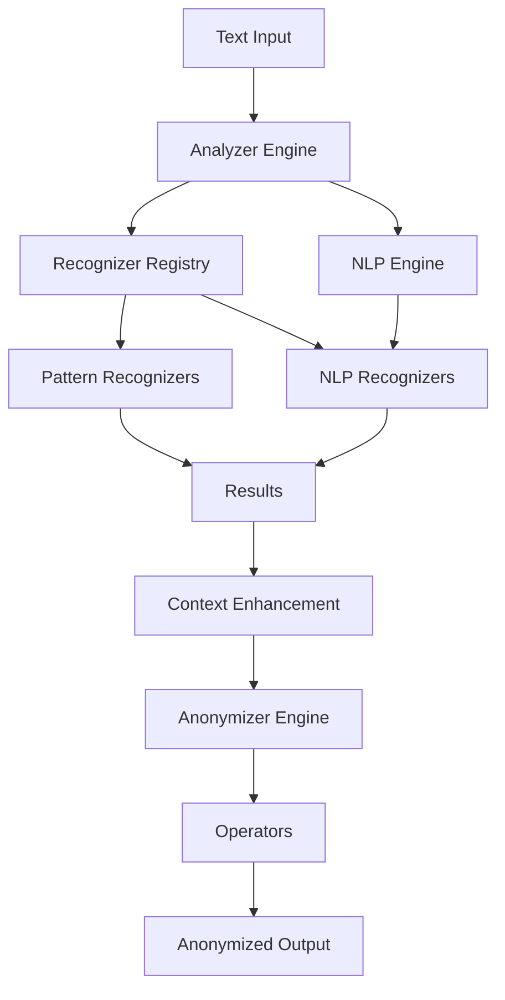
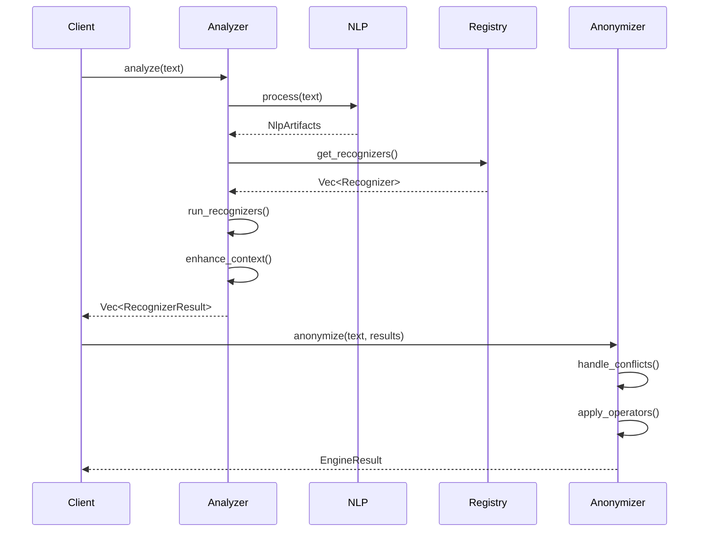

# Presidio Rust Port - Comprehensive Instructions

## Project Overview
Port the Presidio Data Protection and PII De-identification SDK from Python to Rust, maintaining all functionality while leveraging Rust's performance, safety, and type system advantages.

## Phase 1: Project Setup & Foundation (SYNC AFTER THIS PHASE)

### 1.1 Create Rust Workspace Structure
```bash
# Create root Cargo workspace
cargo new --lib presidio-rust
cd presidio-rust

# Create workspace members matching Python modules
cargo new --lib presidio-analyzer
cargo new --lib presidio-anonymizer
cargo new --lib presidio-image-redactor
cargo new --lib presidio-structured
cargo new --bin presidio-cli
cargo new --lib presidio-common  # Shared utilities
```

### 1.2 Configure Workspace Cargo.toml
- Set up workspace dependencies for shared crates
- Configure edition = "2021"
- Set up feature flags for optional components
- Configure profiles (dev, release, bench)

### 1.3 Setup Development Environment
- Create .editorconfig matching Rust best practices
- Set up rustfmt.toml for consistent formatting
- Create clippy.toml for linting rules
- Set up GitHub Actions for CI/CD
- Create Dockerfile for each service

**COMMIT & PUSH:** "feat: initialize Rust workspace structure"

---

## Phase 2: Core Data Structures & Traits (SYNC AFTER THIS PHASE)

### 2.1 presidio-common Crate
Create shared types and traits:

**Core Types:**
```rust
// lib.rs - Core result types
pub struct RecognizerResult {
    pub entity_type: String,
    pub start: usize,
    pub end: usize,
    pub score: f32,
    pub analysis_explanation: Option<AnalysisExplanation>,
    pub recognition_metadata: HashMap<String, serde_json::Value>,
}

pub struct Pattern {
    pub name: String,
    pub regex: Regex,
    pub score: f32,
    pub context: Option<Vec<String>>,
}

pub struct AnalysisExplanation {
    pub recognizer: String,
    pub pattern_name: Option<String>,
    pub pattern: Option<String>,
    pub original_score: f32,
    pub score: f32,
    pub textual_explanation: Option<String>,
    pub score_context_improvement: f32,
    pub supportive_context_word: Option<String>,
    pub validation_result: Option<ValidationResult>,
}

pub enum Language {
    En,
    Es,
    Fr,
    De,
    It,
    Pt,
    // ... all supported languages
}

pub enum EntityType {
    CreditCard,
    Email,
    Phone,
    Ssn,
    Person,
    Location,
    // ... all entity types as enum variants
}
```

**Core Traits:**
```rust
pub trait EntityRecognizer: Send + Sync {
    fn name(&self) -> &str;
    fn supported_entities(&self) -> &[EntityType];
    fn supported_languages(&self) -> &[Language];
    fn analyze(
        &self,
        text: &str,
        entities: Option<&[EntityType]>,
        nlp_artifacts: Option<&NlpArtifacts>,
        context: Option<&[String]>,
    ) -> Result<Vec<RecognizerResult>>;
    fn validate_result(&self, pattern: &str) -> bool {
        true
    }
    fn build_regex_pattern(&self) -> Option<&Regex> {
        None
    }
}

pub trait NlpEngine: Send + Sync {
    fn process(&self, text: &str, language: Language) -> Result<NlpArtifacts>;
    fn is_available(&self, language: Language) -> bool;
}

pub struct NlpArtifacts {
    pub tokens: Vec<String>,
    pub lemmas: Vec<String>,
    pub pos_tags: Vec<String>,
    pub entities: Vec<NlpEntity>,
    pub language: Language,
}
```

### 2.2 Error Handling
```rust
use thiserror::Error;

#[derive(Error, Debug)]
pub enum PresidioError {
    #[error("Invalid pattern: {0}")]
    InvalidPattern(String),

    #[error("Recognizer not found: {0}")]
    RecognizerNotFound(String),

    #[error("Unsupported language: {0:?}")]
    UnsupportedLanguage(Language),

    #[error("NLP engine error: {0}")]
    NlpEngineError(String),

    #[error("Regex error: {0}")]
    RegexError(#[from] regex::Error),

    #[error("IO error: {0}")]
    IoError(#[from] std::io::Error),
}

pub type Result<T> = std::result::Result<T, PresidioError>;
```

**COMMIT & PUSH:** "feat: implement core data structures and traits"

---

## Phase 3: Presidio Analyzer - Core Engine (SYNC AFTER THIS PHASE)

### 3.1 Recognizer Registry
```rust
pub struct RecognizerRegistry {
    recognizers: HashMap<String, Arc<dyn EntityRecognizer>>,
}

impl RecognizerRegistry {
    pub fn new() -> Self;
    pub fn add_recognizer(&mut self, recognizer: Arc<dyn EntityRecognizer>);
    pub fn remove_recognizer(&mut self, name: &str);
    pub fn get_recognizers(&self, language: Language, entities: Option<&[EntityType]>) -> Vec<Arc<dyn EntityRecognizer>>;
}
```

### 3.2 Pattern Recognizer
Implement base pattern-based recognizer:
- Regex compilation and caching
- Context scoring
- Validation hooks

### 3.3 Generic Recognizers
Implement in order of complexity:

1. **EmailRecognizer** (Simple regex)
2. **URLRecognizer** (Using url crate)
3. **IPRecognizer** (IPv4, IPv6 using ipnetwork crate)
4. **PhoneRecognizer** (Using phonenumber crate)
5. **CreditCardRecognizer** (Regex + Luhn checksum validation)
6. **IBANRecognizer** (Regex + IBAN validation)
7. **CryptoRecognizer** (Bitcoin, Ethereum addresses)
8. **DateRecognizer** (Using chrono crate)

### 3.4 Country-Specific Recognizers
Implement major ones:
- US: SSN, Driver License, Passport
- UK: NHS, NINO
- India: Aadhaar, PAN
- Spain: NIF, NIE

### 3.5 Analyzer Engine
```rust
pub struct AnalyzerEngine {
    registry: RecognizerRegistry,
    nlp_engine: Option<Arc<dyn NlpEngine>>,
    context_aware_enhancers: Vec<Box<dyn ContextAwareEnhancer>>,
}

impl AnalyzerEngine {
    pub fn new() -> Self;
    pub fn analyze(
        &self,
        text: &str,
        language: Language,
        entities: Option<&[EntityType]>,
        correlation_id: Option<&str>,
        score_threshold: Option<f32>,
        return_decision_process: bool,
    ) -> Result<Vec<RecognizerResult>>;

    fn enhance_using_context(&self, results: Vec<RecognizerResult>, text: &str, nlp_artifacts: Option<&NlpArtifacts>) -> Vec<RecognizerResult>;
    fn remove_duplicates(&self, results: Vec<RecognizerResult>) -> Vec<RecognizerResult>;
}
```

**COMMIT & PUSH:** "feat: implement analyzer engine and recognizers"

---

## Phase 4: Presidio Anonymizer - Transformation Engine (SYNC AFTER THIS PHASE)

### 4.1 Operator Trait
```rust
pub trait Operator: Send + Sync {
    fn operate(&self, text: &str, params: &OperatorConfig) -> Result<String>;
    fn validate(&self, params: &OperatorConfig) -> Result<()>;
    fn operator_name(&self) -> &str;
}

pub struct OperatorConfig {
    pub operator_name: String,
    pub params: HashMap<String, serde_json::Value>,
}
```

### 4.2 Implement Operators
1. **Replace** - Simple replacement
2. **Redact** - Complete removal
3. **Mask** - Character masking (*, #, etc.)
4. **Hash** - SHA256/SHA512 using sha2 crate
5. **Encrypt/Decrypt** - AES using aes-gcm crate
6. **Keep** - No transformation
7. **Custom** - Closure-based transformation

### 4.3 Anonymizer Engine
```rust
pub struct AnonymizerEngine {
    operators: HashMap<String, Arc<dyn Operator>>,
}

impl AnonymizerEngine {
    pub fn anonymize(
        &self,
        text: &str,
        analyzer_results: &[RecognizerResult],
        operators: &HashMap<String, OperatorConfig>,
        conflict_resolution: ConflictResolutionStrategy,
    ) -> Result<EngineResult>;

    fn handle_conflicts(&self, results: &[RecognizerResult], strategy: ConflictResolutionStrategy) -> Vec<RecognizerResult>;
    fn apply_operators(&self, text: &str, results: &[RecognizerResult], operators: &HashMap<String, OperatorConfig>) -> Result<String>;
}

pub struct EngineResult {
    pub text: String,
    pub items: Vec<OperatorResult>,
}
```

**COMMIT & PUSH:** "feat: implement anonymizer engine and operators"

---

## Phase 5: REST API Servers with Axum (SYNC AFTER THIS PHASE)

### 5.1 Analyzer Service
```rust
use axum::{Router, Json, routing::{get, post}};
use serde::{Deserialize, Serialize};

#[derive(Deserialize)]
struct AnalyzeRequest {
    text: String,
    language: Option<String>,
    entities: Option<Vec<String>>,
    score_threshold: Option<f32>,
}

#[derive(Serialize)]
struct AnalyzeResponse {
    results: Vec<RecognizerResult>,
}

async fn analyze_handler(Json(req): Json<AnalyzeRequest>) -> Json<AnalyzeResponse>;
async fn health_handler() -> &'static str;
async fn recognizers_handler() -> Json<Vec<String>>;
async fn supported_entities_handler() -> Json<Vec<String>>;
```

### 5.2 Anonymizer Service
Similar structure with anonymize/deanonymize endpoints

### 5.3 Docker Configuration
- Multi-stage builds for minimal image size
- Alpine-based runtime images
- Health checks
- Non-root user execution

**COMMIT & PUSH:** "feat: implement REST API services with Axum"

---

## Phase 6: Advanced Features (SYNC AFTER THIS PHASE)

### 6.1 NLP Engine Integration
```rust
// Trait-based abstraction for external NLP engines
pub trait NlpEngine {
    fn process(&self, text: &str, language: Language) -> Result<NlpArtifacts>;
}

// Implementations for:
// - Spacy via Python bindings (PyO3)
// - HTTP-based external NLP service
// - Native Rust NLP libraries (tokenizers, rust-bert)
```

### 6.2 Context-Aware Scoring
```rust
pub trait ContextAwareEnhancer {
    fn enhance_using_context(
        &self,
        results: &[RecognizerResult],
        text: &str,
        nlp_artifacts: Option<&NlpArtifacts>,
    ) -> Vec<RecognizerResult>;
}

// Implementations:
// - LemmaContextAwareEnhancer
// - SupportingContextAwareEnhancer
```

### 6.3 Batch Processing
```rust
pub struct BatchAnalyzerEngine;
pub struct BatchAnonymizerEngine;

impl BatchAnalyzerEngine {
    pub async fn analyze_batch(
        &self,
        texts: Vec<String>,
        // ...
    ) -> Result<Vec<Vec<RecognizerResult>>>;
}
```

**COMMIT & PUSH:** "feat: implement advanced features (NLP, context-aware, batch)"

---

## Phase 7: Image Redactor (SYNC AFTER THIS PHASE)

### 7.1 OCR Integration
```rust
pub trait OcrEngine {
    fn perform_ocr(&self, image: &DynamicImage) -> Result<Vec<OcrResult>>;
}

pub struct TesseractOcr;  // Using tesseract-rs
pub struct AzureDocumentIntelligenceOcr;

pub struct OcrResult {
    pub text: String,
    pub left: u32,
    pub top: u32,
    pub width: u32,
    pub height: u32,
}
```

### 7.2 Image Analyzer Engine
```rust
pub struct ImageAnalyzerEngine {
    analyzer: AnalyzerEngine,
    ocr: Arc<dyn OcrEngine>,
}

impl ImageAnalyzerEngine {
    pub fn analyze_image(
        &self,
        image: &DynamicImage,
        language: Language,
    ) -> Result<Vec<RecognizerResult>>;
}
```

### 7.3 Image Redactor Engine
```rust
pub struct ImageRedactorEngine;

impl ImageRedactorEngine {
    pub fn redact(
        &self,
        image: &DynamicImage,
        analyzer_results: &[RecognizerResult],
        fill_color: Rgba<u8>,
    ) -> Result<DynamicImage>;
}
```

### 7.4 DICOM Support
Using dicom-rs crate for medical image handling

**COMMIT & PUSH:** "feat: implement image redactor with OCR support"

---

## Phase 8: CLI Tool (SYNC AFTER THIS PHASE)

### 8.1 CLI Structure
```rust
use clap::Parser;

#[derive(Parser)]
#[command(author, version, about)]
struct Cli {
    /// Path to scan
    path: PathBuf,

    #[arg(short, long)]
    config: Option<PathBuf>,

    #[arg(short, long)]
    output_format: Option<OutputFormat>,

    #[arg(short, long)]
    allow_list: Option<PathBuf>,
}

enum OutputFormat {
    Standard,
    GitHub,
    Parsable,
    Colored,
}
```

### 8.2 File Scanner
- Use walkdir for recursive scanning
- Pattern-based file filtering (gitignore-style)
- Parallel processing with rayon
- Progress reporting

**COMMIT & PUSH:** "feat: implement CLI scanner tool"

---

## Phase 9: Structured Data Support (SYNC AFTER THIS PHASE)

### 9.1 DataFrame Support
Using polars crate (Rust DataFrame library):
```rust
pub struct StructuredEngine {
    analyzer: AnalyzerEngine,
    anonymizer: AnonymizerEngine,
}

impl StructuredEngine {
    pub fn analyze_dataframe(
        &self,
        df: &DataFrame,
        column_mapping: &HashMap<String, EntityType>,
    ) -> Result<Vec<Vec<RecognizerResult>>>;

    pub fn anonymize_dataframe(
        &self,
        df: &DataFrame,
        // ...
    ) -> Result<DataFrame>;
}
```

### 9.2 JSON Support
Using serde_json for nested JSON handling

**COMMIT & PUSH:** "feat: implement structured data support"

---

## Phase 10: Configuration & Extensibility (SYNC AFTER THIS PHASE)

### 10.1 YAML Configuration
```rust
use serde::{Deserialize, Serialize};

#[derive(Deserialize)]
pub struct RecognizerConfig {
    pub name: String,
    pub supported_entities: Vec<String>,
    pub supported_languages: Vec<String>,
    pub patterns: Vec<PatternConfig>,
    pub context: Option<Vec<String>>,
    pub deny_list: Option<Vec<String>>,
}

// Load from YAML
pub fn load_recognizers_from_yaml(path: &Path) -> Result<Vec<RecognizerConfig>>;
```

### 10.2 Plugin System
Use dynamic library loading (libloading crate) for custom recognizers:
```rust
pub trait RecognizerPlugin {
    fn create_recognizer(&self) -> Box<dyn EntityRecognizer>;
}
```

**COMMIT & PUSH:** "feat: implement configuration and plugin system"

---

## Phase 11: Testing & Quality (SYNC AFTER THIS PHASE)

### 11.1 Unit Tests
- Test each recognizer with known patterns
- Test validation functions (Luhn, IBAN, etc.)
- Test operators with various inputs
- Test conflict resolution

### 11.2 Integration Tests
```rust
#[cfg(test)]
mod integration_tests {
    #[test]
    fn test_full_pipeline() {
        // Analyzer -> Anonymizer -> Verify
    }

    #[test]
    fn test_batch_processing() {
        // Large batch test
    }
}
```

### 11.3 Benchmarks
```rust
use criterion::{black_box, criterion_group, criterion_main, Criterion};

fn benchmark_analyzer(c: &mut Criterion) {
    c.bench_function("analyze_text", |b| {
        b.iter(|| {
            // Benchmark code
        });
    });
}

criterion_group!(benches, benchmark_analyzer);
criterion_main!(benches);
```

### 11.4 Property-Based Testing
Using proptest crate for fuzzing

**COMMIT & PUSH:** "test: comprehensive test suite and benchmarks"

---

## Phase 12: Documentation (SYNC AFTER THIS PHASE)

### 12.1 API Documentation
```rust
//! # Presidio Analyzer
//!
//! The Presidio Analyzer is a context-aware PII detection engine.
//!
//! ## Quick Start
//!
//! ```rust
//! use presidio_analyzer::{AnalyzerEngine, Language};
//!
//! let analyzer = AnalyzerEngine::new();
//! let results = analyzer.analyze(
//!     "My email is john@example.com",
//!     Language::En,
//!     None,
//!     None,
//!     None,
//!     false,
//! )?;
//! ```

// Document all public APIs with rustdoc
```

### 12.2 User Guide (mdBook)
Create comprehensive guides:
- Getting Started
- Architecture Overview
- Recognizers Guide
- Operators Guide
- Custom Recognizers
- Deployment Guide
- API Reference

### 12.3 README Files
- Root README with overview
- Per-crate READMEs with specific info
- Examples directory with working code
- Migration guide from Python

**COMMIT & PUSH:** "docs: comprehensive API and user documentation"

---

## Phase 13: Interactive Visual Diagrams (SYNC AFTER THIS PHASE)

### 13.1 Architecture Diagrams
Create Mermaid diagrams embedded in documentation:



### 13.2 Interactive Documentation
Using mdBook with plugins:
- mermaid-init for diagrams
- Interactive code examples with play.rust-lang.org
- Collapsible sections
- Search functionality

### 13.3 Sequence Diagrams


### 13.4 Component Diagrams
For each major module showing:
- Public API surface
- Internal structure
- Dependencies
- Data flow

**COMMIT & PUSH:** "docs: add interactive visual diagrams"

---

## Phase 14: Performance Optimization (SYNC AFTER THIS PHASE)

### 14.1 Regex Optimization
- Use lazy_static for regex compilation
- Consider regex-automata for hot paths
- Profile regex matching

### 14.2 Parallel Processing
- Use rayon for batch processing
- Thread pool configuration
- Async I/O for external services

### 14.3 Memory Optimization
- Use string slices where possible
- Arc for shared data
- Consider using smallvec, compact_str

### 14.4 Profile-Guided Optimization
- Create realistic benchmarks
- Use cargo-flamegraph
- Optimize hot paths identified

**COMMIT & PUSH:** "perf: optimize performance bottlenecks"

---

## Phase 15: Production Readiness (SYNC AFTER THIS PHASE)

### 15.1 Logging & Observability
```rust
use tracing::{info, warn, error, instrument};

#[instrument]
pub fn analyze(&self, text: &str) -> Result<Vec<RecognizerResult>> {
    info!("Starting analysis");
    // ...
}
```

### 15.2 Metrics
Using prometheus crate:
- Request count
- Request duration
- Error rate
- Entity detection counts

### 15.3 Configuration Management
- Environment variables
- Config file support
- Validation
- Defaults

### 15.4 Security
- Input validation
- Rate limiting
- Timeout handling
- Dependency auditing (cargo-audit)

**COMMIT & PUSH:** "feat: production readiness (logging, metrics, security)"

---

## Phase 16: Container & Deployment (SYNC AFTER THIS PHASE)

### 16.1 Optimized Dockerfiles
```dockerfile
# Multi-stage build
FROM rust:1.75-alpine as builder
WORKDIR /app
COPY . .
RUN cargo build --release --package presidio-analyzer

FROM alpine:latest
RUN apk add --no-cache ca-certificates
COPY --from=builder /app/target/release/presidio-analyzer /usr/local/bin/
EXPOSE 3000
USER 1000:1000
ENTRYPOINT ["presidio-analyzer"]
```

### 16.2 Docker Compose
Orchestrate all services together

### 16.3 Kubernetes Manifests
- Deployments
- Services
- ConfigMaps
- Secrets
- HPA (Horizontal Pod Autoscaler)

### 16.4 Helm Charts
Package for easy deployment

**COMMIT & PUSH:** "feat: container and Kubernetes deployment configs"

---

## Phase 17: CI/CD Pipeline (SYNC AFTER THIS PHASE)

### 17.1 GitHub Actions
```yaml
name: CI
on: [push, pull_request]
jobs:
  test:
    runs-on: ubuntu-latest
    steps:
      - uses: actions/checkout@v3
      - uses: actions-rs/toolchain@v1
      - run: cargo test --all-features
      - run: cargo clippy -- -D warnings
      - run: cargo fmt -- --check

  benchmark:
    runs-on: ubuntu-latest
    steps:
      - run: cargo bench

  security:
    runs-on: ubuntu-latest
    steps:
      - run: cargo audit
```

### 17.2 Release Automation
- Semantic versioning
- Automated changelog
- Binary releases
- Docker image publishing

**COMMIT & PUSH:** "ci: complete CI/CD pipeline"

---

## Phase 18: Examples & Samples (SYNC AFTER THIS PHASE)

### 18.1 Example Applications
Create working examples:
- Simple text analysis
- REST API client
- Batch processing
- Custom recognizer
- Image redaction
- Structured data anonymization

### 18.2 Integration Examples
- Web framework integration (Actix, Axum)
- Database integration
- Message queue processing
- Serverless (AWS Lambda)

**COMMIT & PUSH:** "docs: comprehensive examples and samples"

---

## Phase 19: Migration Tools (SYNC AFTER THIS PHASE)

### 19.1 Python-to-Rust Config Converter
Convert Python YAML configs to Rust format

### 19.2 API Compatibility Layer
Provide similar API surface for easy migration

### 19.3 Migration Guide
Step-by-step guide for existing users

**COMMIT & PUSH:** "feat: migration tools and guides"

---

## Phase 20: Final Polish & Release (FINAL SYNC)

### 20.1 Final Review
- Code review checklist
- Documentation completeness
- Test coverage > 80%
- All clippy warnings resolved
- Security audit completed

### 20.2 Performance Comparison
Benchmark against Python version:
- Throughput
- Latency
- Memory usage
- Startup time

### 20.3 Release Preparation
- Version 0.1.0
- Release notes
- crates.io publication
- Docker Hub publication
- Announcement blog post

**FINAL COMMIT & PUSH:** "release: presidio-rust v0.1.0"

---

## Dependencies Summary

### Core Crates
- `regex` - Pattern matching
- `serde`, `serde_json` - Serialization
- `thiserror` - Error handling
- `anyhow` - Error propagation
- `tokio` - Async runtime
- `axum` - Web framework
- `tower` - Middleware
- `tracing`, `tracing-subscriber` - Logging

### Validation & Crypto
- `sha2` - Hashing
- `aes-gcm` - Encryption
- `phonenumber` - Phone validation
- `iban` - IBAN validation

### Data Processing
- `polars` - DataFrames
- `chrono` - Date/time
- `url` - URL parsing
- `ipnetwork` - IP address handling

### Image Processing
- `image` - Image manipulation
- `tesseract-rs` - OCR
- `dicom-rs` - DICOM support

### CLI & Config
- `clap` - CLI argument parsing
- `serde_yaml` - YAML config
- `walkdir` - File traversal
- `rayon` - Parallel processing

### Testing & Benchmarking
- `criterion` - Benchmarks
- `proptest` - Property testing
- `mockall` - Mocking

### Observability
- `prometheus` - Metrics
- `opentelemetry` - Tracing

---

## Coding Standards

### Naming Conventions
- Crates: `presidio-*` (kebab-case)
- Modules: `snake_case`
- Types/Structs/Enums: `PascalCase`
- Functions/methods: `snake_case`
- Constants: `SCREAMING_SNAKE_CASE`
- Traits: `PascalCase` (prefer nouns or adjectives)

### Code Organization
- One module per file
- Group related functionality
- Public API at top of file
- Private helpers below
- Tests in same file or tests/ directory

### Documentation
- All public items must have rustdoc
- Include examples in docs
- Document panics, errors, safety
- Use //! for module-level docs
- Use /// for item-level docs

### Error Handling
- Use Result<T, PresidioError> for fallible operations
- Use thiserror for custom errors
- Provide context with error messages
- Avoid unwrap() in library code

### Testing
- Unit tests in same file
- Integration tests in tests/
- Property tests for validation
- Benchmark hot paths
- Aim for >80% coverage

### Safety & Security
- Avoid unsafe unless necessary
- Document safety invariants
- Validate all inputs
- Use type system for correctness
- Regular security audits

---

## Regular Sync Points
After EVERY phase completion:
1. Run cargo fmt
2. Run cargo clippy
3. Run cargo test
4. Commit with descriptive message
5. Push to branch

---

## Success Criteria
- [ ] All Python functionality ported
- [ ] 80%+ test coverage
- [ ] Comprehensive documentation
- [ ] Interactive diagrams
- [ ] Performance equal or better than Python
- [ ] CI/CD pipeline green
- [ ] Security audit passed
- [ ] Examples working
- [ ] Docker images published
- [ ] crates.io published
