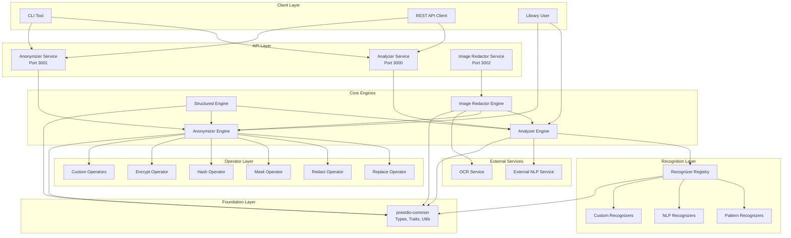
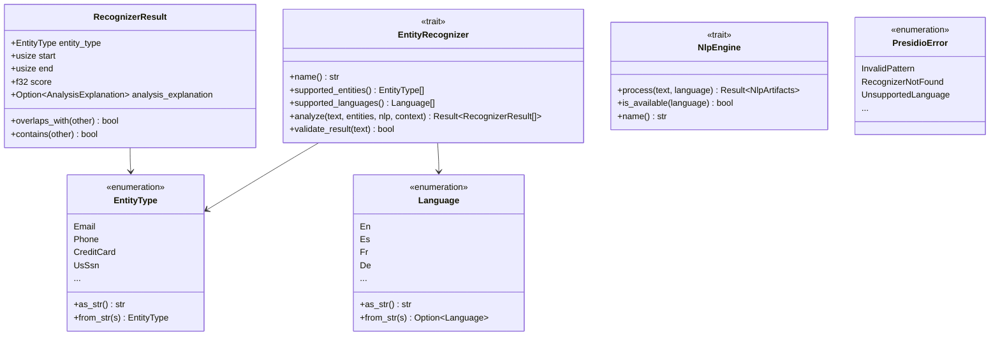
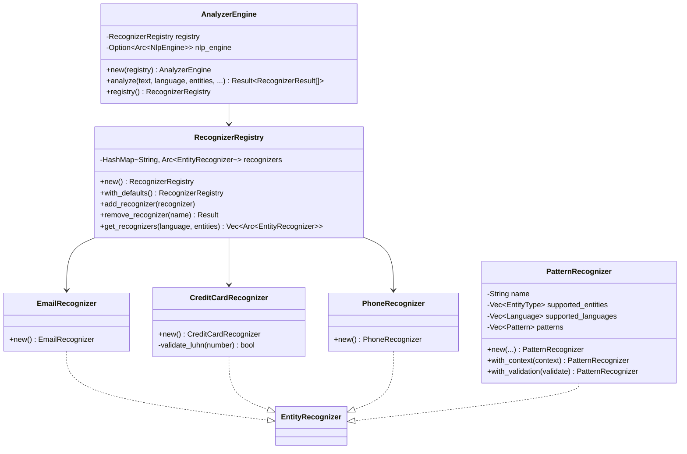
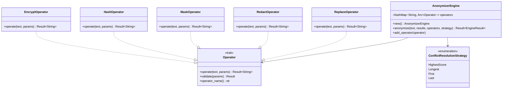
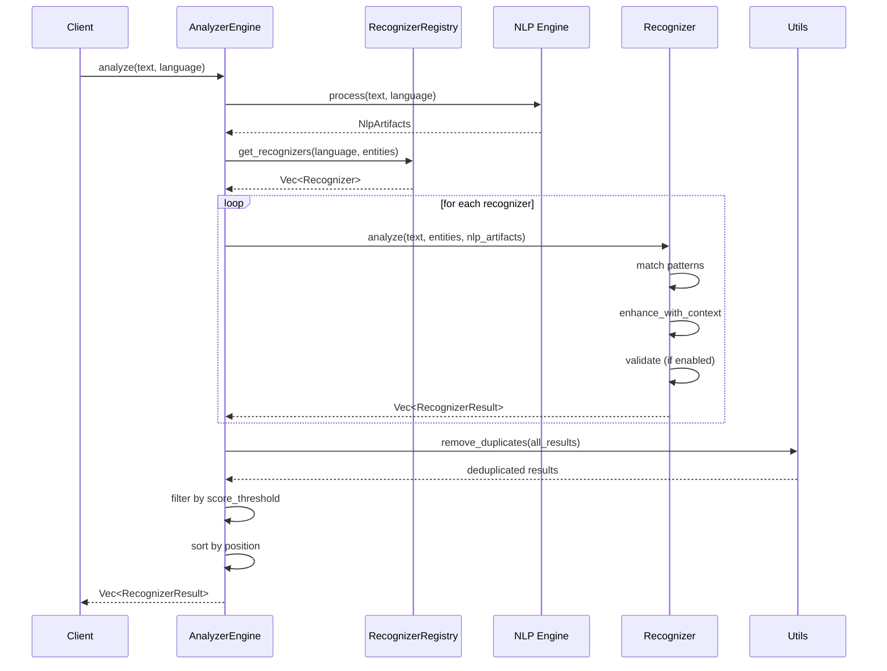
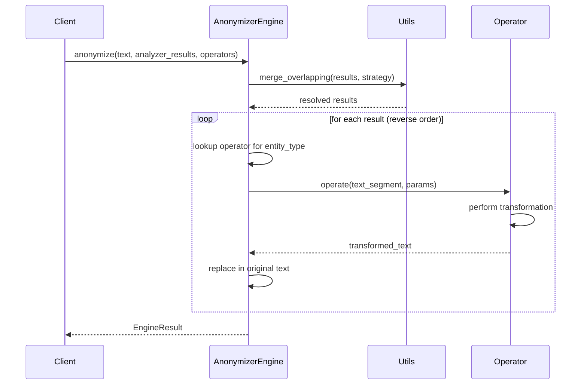
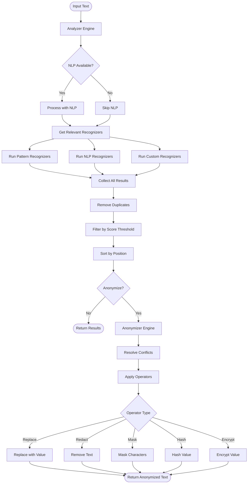
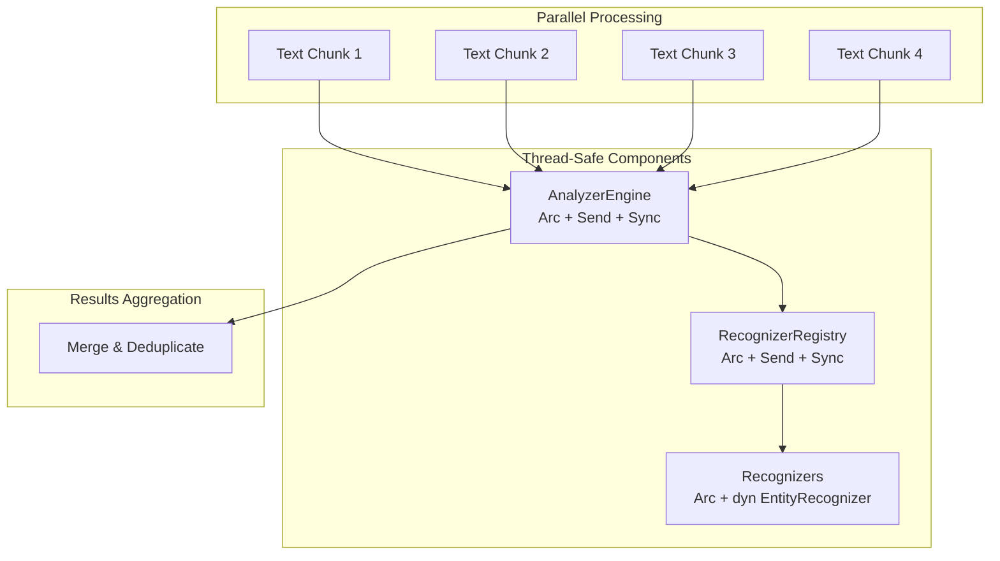
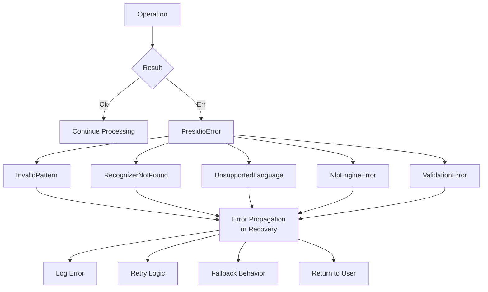

# Presidio Rust Port - Architecture

## Overview

This document provides a comprehensive architectural overview of the Presidio Rust port, including system design, component interactions, and data flow.

## System Architecture



## Component Architecture

### 1. presidio-common

The foundation library providing shared types, traits, and utilities.



### 2. presidio-analyzer

The PII detection engine.



### 3. presidio-anonymizer

The PII transformation engine.



## Data Flow

### Analysis Flow



### Anonymization Flow



### End-to-End PII Detection and Anonymization



## Concurrency Model



## Design Patterns

### 1. **Registry Pattern**
- `RecognizerRegistry` manages all available recognizers
- Allows dynamic addition/removal of recognizers
- Supports filtering by language and entity type

### 2. **Strategy Pattern**
- `ConflictResolutionStrategy` for handling overlapping entities
- Multiple operator types for different anonymization strategies

### 3. **Trait Objects (Polymorphism)**
- `EntityRecognizer` trait allows for different recognition implementations
- `Operator` trait for pluggable anonymization operations
- `NlpEngine` trait for external NLP service integration

### 4. **Builder Pattern**
- `PatternRecognizer::new().with_context().with_validation()`
- `AnalyzerEngine::new().with_nlp_engine()`

### 5. **Lazy Evaluation**
- Regex compilation using `lazy_static!`
- On-demand NLP processing

## Performance Optimizations

1. **Zero-Cost Abstractions**
   - Trait objects with dynamic dispatch only where needed
   - Generic types with monomorphization

2. **Memory Efficiency**
   - String slices (`&str`) instead of owned strings where possible
   - Arc for shared ownership without copying

3. **Regex Optimization**
   - Pre-compiled regexes using `lazy_static`
   - Regex caching to avoid recompilation

4. **Parallel Processing**
   - Thread-safe design allows parallel text processing
   - Rayon for data parallelism in batch operations

5. **Conflict Resolution**
   - Efficient overlap detection
   - Single-pass deduplication

## Error Handling



## Extension Points

### Adding a New Recognizer

```rust
use presidio_common::{EntityRecognizer, EntityType, Language, RecognizerResult, Result};

pub struct MyCustomRecognizer;

impl EntityRecognizer for MyCustomRecognizer {
    fn name(&self) -> &str {
        "MyCustomRecognizer"
    }

    fn supported_entities(&self) -> &[EntityType] {
        &[EntityType::Custom("MY_TYPE".to_string())]
    }

    fn supported_languages(&self) -> &[Language] {
        &[Language::En]
    }

    fn analyze(
        &self,
        text: &str,
        _entities: Option<&[EntityType]>,
        _nlp_artifacts: Option<&NlpArtifacts>,
        _context: Option<&[String]>,
    ) -> Result<Vec<RecognizerResult>> {
        // Custom detection logic
        Ok(vec![])
    }
}

// Usage
let mut registry = RecognizerRegistry::new();
registry.add_recognizer(Arc::new(MyCustomRecognizer));
```

### Adding a New Operator

```rust
use presidio_common::{Operator, OperatorConfig, Result};

pub struct MyCustomOperator;

impl Operator for MyCustomOperator {
    fn operate(&self, text: &str, params: &OperatorConfig) -> Result<String> {
        // Custom transformation logic
        Ok(text.to_uppercase())
    }

    fn validate(&self, _params: &OperatorConfig) -> Result<()> {
        Ok(())
    }

    fn operator_name(&self) -> &str {
        "my_custom"
    }
}
```

## Testing Strategy

### Unit Tests
- Each recognizer has dedicated tests
- Operator validation tests
- Utility function tests

### Integration Tests
- End-to-end analysis pipeline
- Combined analyzer + anonymizer flow
- Multi-language testing

### Performance Tests
- Benchmark regex matching
- Batch processing throughput
- Memory usage profiling

## Security Considerations

1. **Input Validation**
   - Regex pattern validation
   - Parameter sanitization
   - Size limits for text input

2. **Cryptography**
   - Industry-standard algorithms (AES-GCM, SHA-256)
   - Secure random number generation
   - Key management best practices

3. **Data Protection**
   - No persistent storage of PII
   - Memory cleanup for sensitive data
   - Audit logging support

## Future Enhancements

1. **Additional Recognizers**
   - More country-specific identifiers
   - Industry-specific patterns (medical, financial)
   - Custom ML-based recognizers

2. **Performance**
   - GPU acceleration for large-scale processing
   - Streaming API for large texts
   - Incremental processing

3. **Features**
   - Multi-language NLP support
   - Advanced context-aware scoring
   - Reversible anonymization with token vault
   - Real-time API rate limiting

4. **Integrations**
   - Kafka/RabbitMQ connectors
   - Cloud provider integrations (AWS, Azure, GCP)
   - Database anonymization plugins
